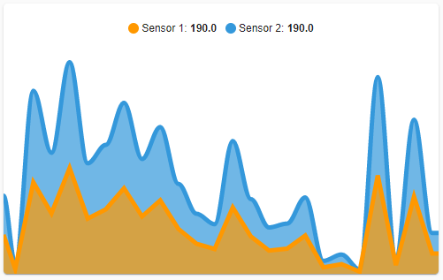
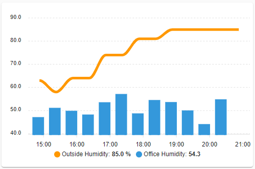
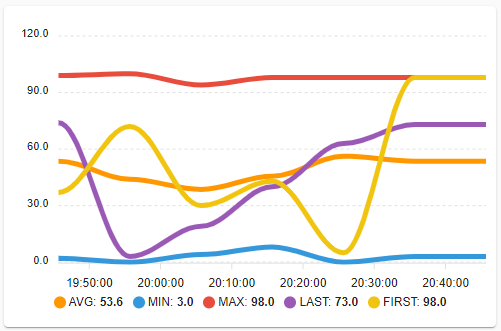

[](LICENSE)
[](https://github.com/custom-components/hacs)


[](https://github.com/RomRider/apexcharts-card/releases/latest)
[](https://github.com/RomRider/apexcharts-card/releases)
[](https://community.home-assistant.io/t/apexcharts-card-a-highly-customizable-graph-card/272877)

# ApexCharts Card by [@RomRider](https://github.com/RomRider) <!-- omit in toc -->


This is higly customizable graph card for [Home-Assistant](https://www.home-assistant.io)'s Lovelace UI.<br/>

It is based on [ApexCharts.js](https://apexcharts.com) and offers most of the features of the library.

It is also inspired by the great [`mini-graph-card`](https://github.com/kalkih/mini-graph-card) by [@kalkih](https://github.com/kalkih)


However, some things might be broken :grin:

## Table of Content <!-- omit in toc -->

- [Installation](#installation)
  - [HACS (recommended)](#hacs-recommended)
  - [Manual install](#manual-install)
  - [CLI install](#cli-install)
  - [Add resource reference](#add-resource-reference)
- [Using the card](#using-the-card)
  - [Main Options](#main-options)
  - [`series` Options](#series-options)
  - [`series.show` Options](#seriesshow-options)
  - [Main `show` Options](#main-show-options)
  - [`header` Options](#header-options)
  - [`group_by` Options](#group_by-options)
  - [`func` Options](#func-options)
  - [`span` Options](#span-options)
  - [`data_generator` Option](#data_generator-option)
  - [Apex Charts Options Example](#apex-charts-options-example)
  - [Layouts](#layouts)
- [Known issues](#known-issues)
- [Roadmap](#roadmap)
- [Examples](#examples)
  - [Simple graph](#simple-graph)
  - [Multiple Types of Graphs](#multiple-types-of-graphs)
  - [Aggregating data](#aggregating-data)
  - [Compare data from today with yesterday](#compare-data-from-today-with-yesterday)

## Installation

### HACS (recommended)

This card is available in [HACS](https://hacs.xyz/) (Home Assistant Community Store).
<small>_HACS is a third party community store and is not included in Home Assistant out of the box._</small>

### Manual install

1. Download and copy `apexcharts-card.js` from the [latest release](https://github.com/RomRider/apexcharts-card/releases/latest) into your `config/www` directory.

2. Add the resource reference as decribed below.

### CLI install

1. Move into your `config/www` directory.

2. Grab `apexcharts-card.js`:

```
$ wget https://github.com/RomRider/apexcharts-card/releases/download/v1.3.0/apexcharts-card.js
```

3. Add the resource reference as decribed below.

### Add resource reference

If you configure Lovelace via YAML, add a reference to `apexcharts-card.js` inside your `configuration.yaml`:

```yaml
resources:
  - url: /local/apexcharts-card.js?v=1.3.0
    type: module
```

Else, if you prefer the graphical editor, use the menu to add the resource:

1. Make sure, advanced mode is enabled in your user profile (click on your user name to get there)
2. Navigate to Configuration -> Lovelace Dashboards -> Resources Tab. Hit orange (+) icon
3. Enter URL `/local/apexcharts-card.js` and select type "JavaScript Module".
4. Restart Home Assistant.

## Using the card

### Main Options

:warning: Since this card is in its debuts, you should expect breaking changes moving forward. :warning:

The card stricly validates all the options available (but not for the `apex_config` object). If there is an error in your configuration, it will tell you where and display a red error card.


:white_check_mark: **means required**.

| Name | Type | Default | Since | Description |
| ---- | :--: | :-----: | :---: | ----------- |
| :white_check_mark: `type` | string | | v1.0.0 | `custom:apexcharts-card` |
| :white_check_mark: `series` | array | | v1.0.0 | See [series](#series-options) |
| `update_interval` | string | | v1.1.0 | By default the card updates on every state change. Setting this overrides the behaviour. Valid values are any time string, eg: `1h`, `12min`, `1d`, `1h25`, `10sec`, ... |
| `graph_span` | string | `24h` | v1.1.0 | The span of the graph as a time interval. Valid values are any time string, eg: `1h`, `12min`, `1d`, `1h25`, `10sec`, ... |
| `span` | object | | v1.2.0 | See [span](#span-options) |
| `show` | object | | v1.0.0 | See [show](#main-show-options) |
| `cache` | boolean | `true` | v1.0.0 | Use in-browser data caching to reduce the load on Home Assistant's server |
| `stacked` | boolean | `false` | v1.0.0 | Enable if you want the data to be stacked on the graph |
| `layout` | string | | v1.0.0 | See [layouts](#layouts) |
| `header` | string | | v1.0.0 | See [header](#header-options) |
| `y_axis_precision` | numnber | `1` | v1.2.0 | The float precision used to display numbers on the Y axis |
| `apex_config`| object | | v1.0.0 | Apexcharts API 1:1 mapping. You call see all the options [here](https://apexcharts.com/docs/installation/) --> `Options (Reference)` in the Menu. See [Apex Charts](#apex-charts-options-example) |


### `series` Options

| Name | Type | Default | Since | Description |
| ---- | :--: | :-----: | :---: | ----------- |
| :white_check_mark: `entity` | string | | v1.0.0 | The `entity_id` of the sensor to display |
| `name` | string | | v1.0.0 | Override the name of the entity |
| `color` | string | | v1.1.0 | Color of the serie. Supported formats: `yellow`, `#aabbcc`, `rgb(128, 128, 128)` or `var(--css-color-variable)` |
| `type` | string | `line` | v1.0.0 | `line`, `area` or `column` are supported for now |
| `curve` | string | `smooth` | v1.0.0 | `smooth` (nice curve),  `straight` (direct line between points) or `stepline` (flat line until next point then straight up or down) |
| `extend_to_end` | boolean | `true` | v1.0.0 | If the last data is older than the end time displayed on the graph, setting to true will extend the value until the end of the timeline. Only works for `line` and `area` types. |
| `unit` | string | | v1.0.0 | Override the unit of the sensor |
| `float_precision` | number | `1` | v1.2.0 | The precision used to display data in the legend and the tooltip. It doesn't impact how the data is displayed on the graph |
| `group_by` | object | | v1.0.0 | See [group_by](#group_by-options) |
| `invert` | boolean | `false` | v1.2.0 | Negates the data (`1` -> `-1`). Usefull to display opposites values like network in (standard)/out (inverted) |
| `data_generator` | string | | v1.2.0 | See [data_generator](#data_generator-option) |
| `offset` | string | | v1.3.0 | This is different from the main `offset` parameter. This is at the series level. It is only usefull if you want to display data from for eg. yesterday on top of the data from today for the same sensor and compare the data. The time displayed in the tooltip will be wrong as will the x axis information. Valid values are any negative time string, eg: `-1h`, `-12min`, `-1d`, `-1h25`, `-10sec`, ... |


### `series.show` Options

| Name | Type | Default | Since | Description |
| ---- | :--: | :-----: | :---: | ----------- |
| `legend_value` | boolean | `true` | v1.3.0 | Show/Hide the state in the legend. Will still display the name |
| `as_duration` | string | | v1.3.0 | Will pretty print the states as durations. Doesn't affect the graph, only the tooltip/legend/header display. You provide the source unit of your sensor. Valid values are `millisecond`, `second`, `minute`, `hour`, `day`, `week`, `month`, `year`.<br/>Eg: if the state is `345` and `as_duration` is set to `minute` then it would display `5h 45m` |


### Main `show` Options

| Name | Type | Default | Since | Description |
| ---- | :--: | :-----: | :---: | ----------- |
| `loading` | boolean | `true` | v1.0.0 | Displays a spinning icon while the data is loading/updating |

### `header` Options

| Name | Type | Default | Since | Description |
| ---- | :--: | :-----: | :---: | ----------- |
| `show` | boolean | `false` | v1.0.0 | Show or hide the header |
| `floating` | boolean | `false` | v1.0.0 | Makes the header float above the graph. Positionning will be supported later |
| `show_states` | boolean | `false` | v1.1.0 | Show or hide the states in the header |
| `colorize_states` | boolean | `false` | v1.1.0 | Colorize the states based on the color of the serie |

### `group_by` Options

| Name | Type | Default | Since | Description |
| ---- | :--: | :-----: | :---: | ----------- |
| `func` | string | `raw` | v1.0.0 | See [func](#func-options) |
| `duration` | string | `1h` | v1.0.0 | If `func` is **not** `raw` only. It builds buckets of states over `duration` period of time. Doesn't work for months. Eg of valid values: `2h`, `1d`, `10s`, `25min`, `1h30`, ... |
| `fill` | string | `last` | v1.0.0 | If `func` is **not** `raw` only. If there is any missing value in the states history, `last` will replace it the last non-empty state, `zero` will fill missing values with `0`, `'null'` will fill missing values with `null`

### `func` Options

| Name | Since | Description |
| ---- | :---: | ----------- |
| `raw` | v1.0.0 | Displays all the state history as known by Home Assistant |
| `avg` | v1.0.0 | Will return the average of all the states in each bucket |
| `min` | v1.0.0 | Will return the smallest state of each bucket |
| `max` | v1.0.0 | Will return the biggest state of each bucket |
| `last` | v1.0.0 | Will return the last state of each bucket |
| `first` | v1.0.0 | Will return the first state of each bucket |
| `sum` | v1.0.0 | Will return the sum of all the states in each bucket |
| `median` | v1.0.0 | Will return the median of all the states in each bucket |
| `delta` | v1.0.0 | Will return the delta between the biggest and smallest state in each bucket |

### `span` Options

| Name | Since | Description |
| ---- | :---: | ----------- |
| `start` | v1.2.0 | Display the graph from the begining of the `minute`, `day`, `hour`, `week`, `month`, `year` |
| `end` | v1.2.0 | Display the graph from the end of the `minute`, `day`, `hour`, `week`, `month`, `year` |
| `offset` | v1.2.0 | Offset the graph by an amount of time. To offset in the past, start with `-`. Eg. of valid values: `-1day`, `-12h`, `12h`, `30min`, ... |

Span enables you to:
* Offset the graph by an amount of time
* `start`: Display the graph from the begining of the `minute`, `day`, `hour`, `week`, `month`, `year`. In this case, `graph_span` should be in most cases `<=` to 1 unit of the unit defined in start.
* `end`: Display the graph from the end of the `minute`, `day`, `hour`, `week`, `month`, `year`
* Combined with `group_by` in a serie, the group will begin at the tick of the `start` unit (+/- `offset` if defined)
* Only one of `start` or `end` is supported at the same time

```yaml
graph_span: If start is defined, it should be <= to 1 unit of the one defined in `start`
span:
  start: minute, day, hour, week, month or year
  end: minute, day, hour, week, month or year
  offset: To offset in the past, prefix with `-` Timerange like 1day, 12h, 10min, -12h, -1d, ...
```

Eg:
* Display 24h from the start of the current day (00:00 -> 23:59)
  ```yaml
  type: custom:apexcharts-card
  graph_span: 24h
  span:
    start: day
  ```
* Display 24h from the start of the previous day (00:00 -> 23:59, -1 day)
  ```yaml
  type: custom:apexcharts-card
  graph_span: 24h
  span:
    start: day
    offset: -1d
  ```
* Display 12h between 06:00 and 18:00 of the current day
  ```yaml
  type: custom:apexcharts-card
  graph_span: 12h
  span:
    start: day
    offset: +6h
  ```
* Display the last 7 days, the end of the graph is the end of the current day
  ```yaml
  type: custom:apexcharts-card
  graph_span: 7d
  span:
    end: day
  ```

### `data_generator` Option

Before we start, to learn javascript, google is your friend or ask for help on the [forum](https://community.home-assistant.io/t/apexcharts-card-a-highly-customizable-graph-card/272877) :slightly_smiling_face:

`data_generator` is an advanced feature. It enables you to build your own data out of the last state of a sensor. It completely bypasses the history retrieval and caching mecanism.

You'll need to write a javascript function which returns a `[timestamp, value][]`:
* `timestamp` is the timestamp of the data in ms
* `value` is the value of the data as a number or a float, make sure you parse it if it's a string.

Inside your javascript code, you'll have access to those variables:
* `entity`: the entity object
* `start` (Date object): the start Date object of the graph currently displayed
* `end` (Date object): the end Date object of the graph currently displayed
* `hass`: the complete `hass` object
* `moment`: the [Moment.JS](https://momentjs.com/) object to help you manipulate time and dates

Let's take this example:
* My sensor (`sensor.test`) has this state as its last state:
  ```yaml
  FirstPeak: High
  PeakTimes:
    - '2021-01-27 03:43:00'
    - '2021-01-27 10:24:00'
    - '2021-01-27 16:02:00'
    - '2021-01-27 22:38:00'
    - '2021-01-28 04:21:00'
    - '2021-01-28 11:06:00'
    - '2021-01-28 16:40:00'
    - '2021-01-28 23:18:00'
    - '2021-01-29 05:00:00'
    - '2021-01-29 11:45:00'
    - '2021-01-29 17:19:00'
    - '2021-01-29 23:58:00'
    - '2021-01-30 05:39:00'
    - '2021-01-30 12:25:00'
    - '2021-01-30 17:59:00'
  PeakHeights:
    - 4.99
    - 1.41
    - 4.96
    - 1.33
    - 5.22
    - 1.19
    - 5.15
    - 1.14
    - 5.42
    - 1.01
    - 5.3
    - 0.99
    - 5.57
    - 0.87
    - 5.39
  unit_of_measurement: m
  friendly_name: Tides
  ```
* This is data in the future, but I want to display them so I need to build them myself using `data_generator`:
  ```yaml
  type: custom:apexcharts-card
  graph_span: 4d # I have 4 days worth of data in the future in the attributes
  span:
    start: hour # I want to display from the start of the current hours 4 days into the future
  series:
    - entity: sensor.test
      data_generator: | # This is what builds the data
        return entity.attributes.PeakTimes.map((peak, index) => {
          return [new Date(peak), entity.attributes.PeakHeights[index]];
        });
  ```
  The result of this function call would be something like: <br/>
  `[[1611718980000, 4.99], [1611743040000, 1.41], [1611763320000, 4.96], ...]`

* And this is all you need :tada:

### Apex Charts Options Example

This is how you could change some options from ApexCharts as described on the [`Options (Reference)` menu entry](https://apexcharts.com/docs/installation/).

Some options might now work in the context of this card.

```yaml
type: custom:apexcharts-card
series:
  - ...
apex_config:
  dataLabels:
    enabled: true
    dropShadow:
      enabled: true
```

### Layouts

For now, only `minimal` is supported: It will remove the grid, the axis and display the legend at the top. But you can use the `apex_config` to do whatever you want.

* `minimal`

  

For code junkies, you'll find the default options I use in [`src/apex-layouts.ts`](src/apex-layouts.ts)

## Known issues

* Sometimes, if `smoothing` is used alongside `area` and there is missing data in the chart, the background will be glitchy. See [apexcharts.js/#2180](https://github.com/apexcharts/apexcharts.js/issues/2180)
* `binary_sensor` is not yet supported.
* Bars will span left and right of the data point. Not so great if you use `func` to aggregate your data. See [apexcharts.js/#1688](https://github.com/apexcharts/apexcharts.js/issues/1688)

## Roadmap

Not ordered by priority:

* [ ] Support more types of charts (pie, radial, polar area at least)
* [ ] Support for `binary_sensors`
* [X] ~~Support for aggregating data with exact boundaries (ex: aggregating data with `1h` could aggregate from `2:00:00am` to `2:59:59am` then `3:00:00am` to `3:59:59` exactly, etc...)~~
* [X] ~~Display the graph from start of day, week, month, ... with support for "up to now" or until the "end of the period"~~
* [ ] Support for any number of Y-axis
* [ ] Support for logarithmic
* [ ] Support for state mapping for non-numerical state sensors
* [ ] Support for simple color threshold (easier to understand/write than the ones provided natively by ApexCharts)
* [ ] Support for graph configuration templates à la [`button-card`](https://github.com/custom-cards/button-card/blob/master/README.md#configuration-templates)

## Examples

### Simple graph

```yaml
type: custom:apexcharts-card
series:
  - entity: sensor.temperature
```

### Multiple Types of Graphs



```yaml
type: custom:apexcharts-card
graph_span: 6h
header:
  show: false
series:
  - entity: sensor.humidity
    type: line
    name: Outside Humidity
    group_by:
      func: avg
      duration: 30min
  - entity: sensor.random0_100
    type: column
    name: Office Humidity
    group_by:
      func: avg
      duration: 30min
```

### Aggregating data



```yaml
type: custom:apexcharts-card
graph_span: 1h
header:
  show: false
series:
  - entity: sensor.random0_100
    name: AVG
    curve: smooth
    type: line
    group_by:
      duration: 10min
      func: avg
  - entity: sensor.random0_100
    curve: smooth
    name: MIN
    type: line
    group_by:
      duration: 10min
      func: min
  - entity: sensor.random0_100
    curve: smooth
    name: MAX
    type: line
    group_by:
      duration: 10min
      func: max
  - entity: sensor.random0_100
    curve: smooth
    name: LAST
    type: line
    group_by:
      duration: 10min
      func: last
  - entity: sensor.random0_100
    curve: smooth
    name: FIRST
    type: line
    group_by:
      duration: 10min
      func: first
```

### Compare data from today with yesterday

```yaml
type: custom:apexcharts-card
graph_span: 1d
span:
  start: day
header:
  show: false
series:
  # data from today
  - entity: sensor.temperature
  # data from yesterday offsetted to be displayed today
  - entity: sensor.temperature
    offset: -1d
```